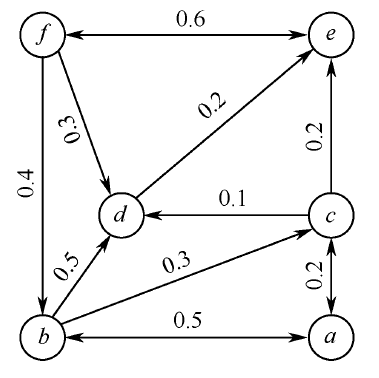

### 社交网络-独立级联模型仿真

#### 算法如下：

- 初始的活跃节点集合 A。 
- 在 t 时刻，新近被激活的节点 u 对它的邻接节点 v 产生影响，成功的概率为 p（u,v ）。若v有多个邻居节点都是新近被激活的节点，那么这些节点将以任意顺序尝试激活节点v。
- 如果节点 v 被激活成功，那么在 t+1 时刻，节点 v 转为活跃状态，将对其邻接非活跃节点产生影响；否则，节点 v 在 t+1 时刻状态不发生变化。
- 该过程不断进行重复，直到网络中不存在有影响力的活跃节点时，传播过程结束。

> 其中，边的方向代表“被关注”，边权重代表节点激活的概率，例如b→c 的权重为0.3，说明b节点有0.3的概率激活c节点。

此图的独立级联模型传播过程如下。

- 第0时间步：a 节点被激活。
- 第1 时间步：a 节点以0.5 的概率尝试激活b，以0.2 的概率尝试激活c。假设b节点在这一时间步内成功被激活。
- 第2时间步：b节点以0.3的概率尝试激活c，并以0.5 的概率尝试激活d。假设c节点和d 节点在这一时间步内成功被激活。
- 第3时间步：c节点以0.2的概率尝试激活e，d 节点以0.2的概率尝试激活e。假设这一时间步内的尝试都失败了，没有新的节点被激活，传播停止。

**源链接(只有文章没有代码): https://zhuanlan.zhihu.com/p/164608949**

#### gen_graph.py
用于生成图结构（实验品，为了方便理解，没有进行矩阵转换和压缩）
#### test.py
可执行文件，进行模拟
